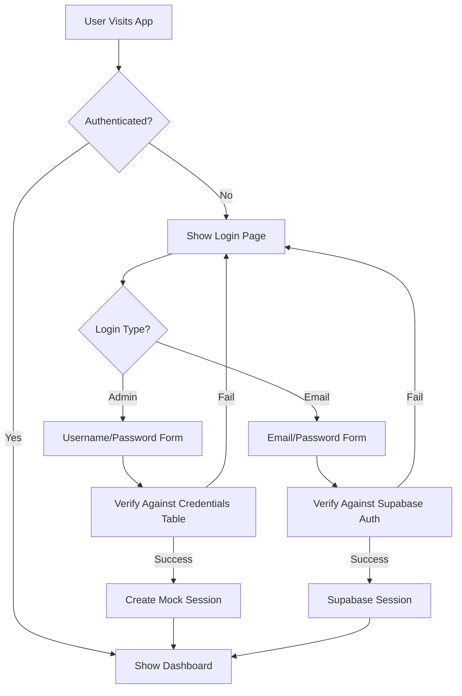

# DreamWeave Protected Authentication Setup

## 🎯 What's Changed

Your DreamWeave application now has **complete authentication protection**! No more public access to analytics and dashboard data.

### ✅ What's Working Now:

1. **Protected Routes**: Dashboard, settings, and all pages are now behind authentication
2. **Admin Login**: Local credentials system with hardcoded admin user
3. **Email Login**: Supabase-based user registration and login
4. **Dual Authentication**: Support for both admin credentials and SSO users
5. **Session Management**: Persistent login across page reloads

## 🚀 Quick Start

### 1. **Set Up Credentials Table** (Required)

Run this SQL in your Supabase SQL Editor:

```sql
-- Copy and paste the entire contents of SUPABASE_CREDENTIALS_SETUP.sql
-- This creates the credentials table and admin user
```

### 2. **Test Admin Login**

1. Visit your app (you'll see the login page immediately)
2. Use the **Admin Login** tab (default)
3. **Username**: `admin`
4. **Password**: `Wreke2re?es?`
5. Click "Sign In as Admin"

### 3. **Test Email Login** (Optional)

1. Switch to **Email Login** tab
2. Click "Don't have an account? Sign up"
3. Create a new user account
4. Verify email (if enabled in Supabase)
5. Sign in with email/password

## 🔐 Authentication Flow



## 🛡️ Security Features

### Current Protection:
- ✅ **No public access** to dashboard or data
- ✅ **Session persistence** across page reloads
- ✅ **Proper logout** clears all sessions
- ✅ **Loading states** prevent flash of wrong content
- ✅ **Admin credentials** stored securely in database
- ✅ **Dual authentication** supports both admin and regular users

### Recommended Next Steps:
- [ ] Enable email confirmation in Supabase
- [ ] Set up Row Level Security (see SUPABASE_AUTH_SETUP.md)
- [ ] Change default admin password
- [ ] Add user roles and permissions

## 🔧 Troubleshooting

### Can't Access Dashboard?
1. **Check the credentials table**: Make sure you ran the SQL setup
2. **Verify admin login**: Username `admin`, Password `Wreke2re?es?`
3. **Clear browser storage**: Go to DevTools → Application → Storage → Clear All
4. **Check console**: Look for authentication errors in browser console

### Email Login Not Working?
1. **Check Supabase setup**: Verify environment variables are set
2. **Email confirmation**: Disable in Supabase if testing locally
3. **SMTP setup**: Configure email provider in Supabase if using production

### Session Issues?
1. **Clear localStorage**: `localStorage.clear()` in browser console
2. **Check session expiry**: Sessions expire after 1 hour
3. **Hard refresh**: Ctrl+F5 to clear all caches

## ⚡ Development Commands

```bash
# Start development server
npm run dev

# View app (will show login immediately)
open http://localhost:3000

# Check if credentials table exists (in Supabase SQL Editor)
SELECT * FROM credentials;

# Test credentials function (in Supabase SQL Editor)
SELECT * FROM verify_credentials_simple('admin', 'Wreke2re?es?');
```

## 📊 What Users See Now

### Before Authentication:
- **Public Dashboard**: ❌ Blocked
- **Analytics Data**: ❌ Blocked
- **Navigation**: ❌ Hidden
- **Settings**: ❌ Blocked

### After Authentication:
- **Full Dashboard**: ✅ Accessible
- **Real-time Data**: ✅ Working
- **All Features**: ✅ Available
- **User Management**: ✅ In Settings

## 🎉 Success!

Your application is now **fully secured**! Users must authenticate before seeing any data or functionality. The dual authentication system gives you flexibility:

- **Admin users**: Quick access with credentials
- **Regular users**: Standard email/password signup flow
- **Future expansion**: Easy to add OAuth, roles, etc.

---

**Ready to go!** Your DreamWeave app is now properly protected. 🔒 